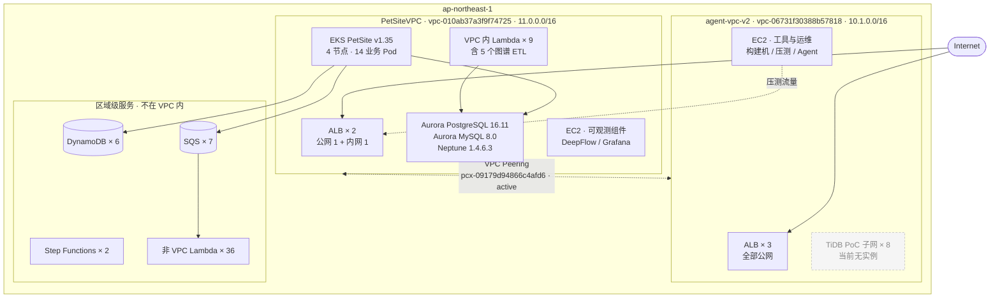
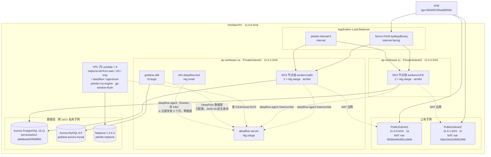
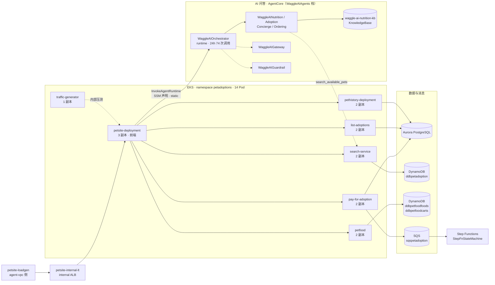
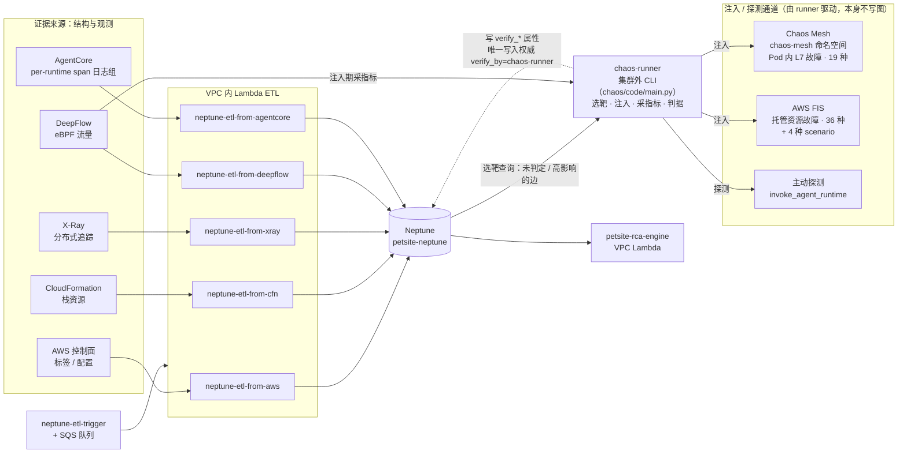
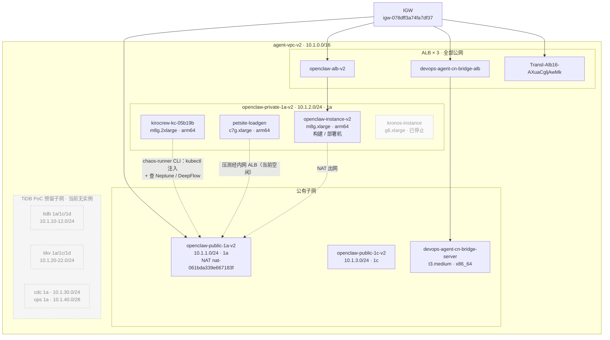

# 东京区域（ap-northeast-1）系统拓扑

> 数据来源：**2026-09-05 14:0x UTC 实时查询** AWS 控制面与 EKS 集群，非文档推断。
> 账号 `926093770964`，区域 `ap-northeast-1`。
>
> 采集方式：`ec2:Describe*` / `eks:DescribeCluster` / `rds:DescribeDBClusters` /
> `elbv2:Describe*` / `dynamodb:ListTables` / `lambda:ListFunctions` / `sqs:ListQueues`
> + `kubectl get deploy,svc`。

---

## 一、总览：两个 VPC 与它们的关系



**两个 VPC 的分工**：`PetSiteVPC` 是**被观测的系统**（PetAdoptions 业务 + 依赖图谱存储），
`agent-vpc-v2` 是**工具与运维侧**（构建、压测、Agent、本机）。二者通过一条 active 的
VPC peering 连通，网段不重叠（11.0 / 10.1）。

---

## 二、PetSiteVPC 详图：按可用区与子网分层



**注意**：EKS 集群的 `resourcesVpcConfig` 同时包含 4 个子网（2 公 2 私），
但**全部工作节点都在私有子网**。集群 endpoint 同时开启 public 与 private 访问。

三个数据库集群共用同一组私有子网（`subnet-0f801fa79077eb277` / `subnet-047a94f9c5ab6302a`），
子网组分别是 `serviceseks2-databasesubnets56f17b9a-*`（两个 Aurora）与
`neptune-subnet-group`（Neptune）。

---

## 三、应用调用链：EKS 内部与数据层



> 调用边的方向按图谱平台已验证的依赖关系绘制。**其中大部分依赖尚未经过
> 故障注入确证**——依赖图上的依赖边中仅少数为 `confirmed`。
> 详见 `docs/fault-injection-coverage-and-production-safety.md`。

### AI 问答这一跳为什么曾经不在图上（2026-09-05 补）

PetSite 的 AI 问答（`WaggleController.cs`）读 SSM 参数
`/petstore/agent/waggleairuntimearn` 拿到 `WaggleAIOrchestrator` 的 ARN，
然后 `InvokeAgentRuntimeAsync` 流式调用。这一跳**此前不在依赖图谱里**，
所以本节的图在 2026-09-05 之前完全没有 agent 层——图是照图谱画的，图谱缺边，图就缺一块。

**五个数据源没有一个覆盖它**，原因各不相同：

| 数据源 | 为什么看不见 |
|---|---|
| DeepFlow（eBPF） | 跨 VPC 到 AWS 托管服务的 HTTPS，L7 解不出 |
| X-Ray | 服务图里 `PetSite -> SimpleSystemsManagement` **存在**、到 Waggle 的边不存在 —— 埋点在（`XRayPipelineHandler` 已从异常栈确认位于 AgentCore 调用管道中），**但这条路径上的调用当时基本都是失败的，而失败调用不产生下游服务节点** |
| AgentCore 控制面 | 只知道自己被调了，不知道谁调的 |
| CloudWatch 指标 | `AWS/Bedrock-AgentCore` 的 `Invocations` 有数据（24h 74 次），但维度里**没有调用方** |
| NFM | VPC 级聚合，粒度不够 |

**已补的那条边靠 SSM 参数**：`agentcore-etl` 读 `/petstore/agent/waggleairuntimearn`
建 `petsite -DependsOn-> WaggleAIOrchestrator`，`dependency_kind='static'`、
`declared_in` 记参数名。它证明「配置上应该调」，**不证明「真的调了」**——
后者要靠调用方侧的观测证据，见上表 X-Ray 那行。

**CloudWatch 那批指标改成写在 runtime 节点上**（`invocations_24h` /
`invocation_errors_24h`），不作为边证据：维度里没有调用方，它答不了「谁在调」，
而且那 74 次里混着管理员直调。实测各 runtime 24h 调用量：
`graph_dependency_mcp` 232（错 2）、`WaggleAIAdoption` 130（**错 34**）、
`WaggleAIOrchestrator` 74（错 4）、`WaggleAINutrition` 35、`WaggleAIConcierge` 17、
`WaggleAIOrdering` 11。

### 更正与补充（2026-09-05 16:5x，实测推翻了上表两条判断）

上表 X-Ray 那行原先写的是「SDK 的内置 AWS 服务清单不含 `BedrockAgentCore`」。
**这个结论是错的**，两条独立证据推翻它：

1. 把清单（`DefaultAWSWhitelist.json`）拉下来看，`services` 只有 6 项 ——
   `DynamoDBv2` / `Lambda` / `S3` / `SQS` / `SageMakerRuntime` / `SNS` ——
   **不含 `SimpleSystemsManagement`**，可后者在服务图里明明有边。
   所以清单只规定"给这 6 个服务额外抓哪些请求参数"，**不是能不能出边的开关**。
2. petsite 容器日志里的异常栈直接显示埋点在位：

   ```
   at Amazon.XRay.Recorder.Handlers.AwsSdk.Internal.XRayPipelineHandler.InvokeAsync[T](...)
   at PetSite.Controllers.WaggleController.SendMessage(ChatRequest) in /src/Controllers/WaggleController.cs:line 96
   ```

真正的原因平淡得多：**这条路径上的调用当时基本都失败，而失败调用不在服务图上
落下游节点。** 一次成功调用（实测 20.5 秒、返回 11 只小狗的真实应答）就具备了
产生边的条件。

> 记这一条不是为了纠正一个技术细节，而是因为**错的排查结论比 bug 更难发现**：
> 它读起来完全合理（新服务、旧 SDK、维护模式），能自圆其说，还能推出一个
> 昂贵且方向错误的行动项（迁 ADOT）。识破它靠的是一个"不该成立却成立"的
> 反例 —— SSM 不在清单里却有边。**下次遇到"某某不支持所以没有"的结论，
> 先找一个同类的反例，比顺着结论往下推便宜得多。**

#### `runtimeSessionId` 必须 ≥ 33 字符，而兜底文案会把它说成网络故障

PetSite 把客户端传来的 `SessionId` 原样透传给 `runtimeSessionId`，不校验长度。
短了被 AgentCore 拒：

```
Amazon.BedrockAgentCore.Model.ValidationException: 1 validation error detected:
Value at 'runtimeSessionId' failed to satisfy constraint:
Member must have length greater than or equal to 33
```

而 `WaggleController` 的兜底把这个 **400** 呈现为
`[Sorry, the connection was interrupted. Please try again.]`，
**HTTP 状态码还是 200**。排查时极易误判成网络问题 ——
本次就用 32 字符的 session id 踩了一次，一度以为复现了线上故障。

这也解释了 AgentCore 的错误指标：`WaggleAIAdoption` 24h 内
**34 次 `UserErrors` / 0 次 `SystemErrors`**，且 34 次**全部集中在一小时内**
（该小时 100 次调用，其余时段 30 次调用 0 错误）。所谓"26% 错误率"是把
一小时突发平铺到 24 小时的假象，**稳态是 0%**。

> `Errors` 混合了 user 与 system 两类，语义完全不同：
> 前者是"调用方发了坏请求"，后者才是"这个 runtime 坏了"。
> 用合并值当健康信号会把 RCA 带偏。

#### Application Signals 的依赖数据远好于 X-Ray 服务图

同一个 `PetSite`，两个 API 给出的下游数量差 8 倍：

| 数据源 | PetSite 的下游 |
|---|---|
| X-Ray `GetServiceGraph` | **1 个**：`SimpleSystemsManagement` |
| Application Signals `ListServiceDependencies` | **10 个（去重）**，且带操作名 |

Application Signals 给出的 10 个：`SimpleSystemsManagement`(GetParameter)、
`PetSearch`(GET /api)、`SecurityToken`(AssumeRoleWithWebIdentity)、
`pethistory-service...:8080`(GET/DELETE /petadoptionshistory)、
`pay-for-adoption...`、`petfood...`(GET /api)、`list-adoptions...`(GET /api)、
`SNS`。

集群上 `amazon-cloudwatch-observability` add-on 已 **ACTIVE（v6.5.0）**，
Application Signals 里已注册 310 个服务 —— 这套数据**早就在了**，
只是依赖图谱还在用 `GetServiceGraph`。

⚠️ 接入前必须先做归一化：Application Signals 为**每个 ReplicaSet 单独注册服务**
（`petsite-deployment-8599bcbfc7`、`-75db64db96`、`pethistory-deployment-58f84c6b8f`…），
且同一个 petsite 有**双身份**（`PetSite`/`generic:default` 来自 X-Ray SDK，
`petsite-deployment`/`eks:petsite/petadoptions` 来自 OTel）。直接接入会被
发布噪声刷爆。

#### agent 侧已经是 ADOT，不需要迁移

5 个 WaggleAI runtime 全部 `AGENT_OBSERVABILITY_ENABLED=true`，24 小时窗口下
在 Application Signals 里全部可见。

> 但 **6 小时窗口下 `WaggleAIAdoption` 会消失** —— 那是流量稀疏，不是配置缺失。
> 曾据此误判它"未接入可观测性"。判断某个服务"没接监控"之前，先确认
> 观察窗口内它**有没有流量**。

#### CloudTrail 拿不到调用方（但可以配）

`InvokeAgentRuntime` 是数据平面操作，**默认不记录**（实测 24h 内 0 条事件）。
`GetAgentRuntime` 这类管理面操作有 370 条。所以想从 CloudTrail 拿"谁调了这个
runtime"，需要**显式开启 AgentCore 的数据事件**，那是一条独立的 observed 证据源。

---

## 四、依赖图谱平台的数据流



### 为什么写入权威是 runner，而不是 Chaos Mesh

`verify_*` 这批验证属性的**写入权威只有 `chaos-runner` 一个** —— 契约里
`edge_verification.authority: ['chaos-runner']`，活图谱里 38 条带 `verify_*` 的边
**全部** `verify_by=chaos-runner`，没有第二个取值 `[实测]`。五个 ETL 只写结构与
观测属性，不写验证结论。

**Chaos Mesh 是 runner 的一个注入后端，它自己不写 Neptune。** 它跑在 `chaos-mesh`
命名空间里，只负责往 Pod 上打故障；真正查 Neptune 选靶、采指标、跑判据、写回结论的是
集群外的 runner CLI（集群内**没有** runner 部署，`chaos-mesh` 里只有
controller-manager × 3 / daemon × 4 / dashboard / dns-server `[实测]`）。
把后端画成写入权威，等于把「打故障的手」画成「下结论的人」。

### AWS FIS 是主力后端，不是补充

| 后端 | 实验规格声明 | 故障目录 | 已判定的边 | 能打什么 |
|---|--:|--:|--:|---|
| **`fis`** | **65** | **36 种** | **7** | AWS 托管资源：RDS 重启、EC2 停机、API 错误注入 |
| `chaosmesh` | 22 | 19 种 | 27 | Pod 内 L7：`http_chaos` abort / delay、network |
| `fis-scenario` | 2 | 4 种 | — | FIS 官方场景模板 |
| `composite` | 3 | — | — | 同一实验里两种后端混用 |

两者**互补而非重叠**：`exp-serviceseks2-databaseb269d8bb-...-fis-rds-reboot-...`
这类 RDS 重启故障 Chaos Mesh 根本打不了，只有 FIS 能打；反过来 Pod 内的 HTTP abort
只有 Chaos Mesh 能做。代码里 `chaos/code/runner/fis_backend.py` 的 `FISClient` 与
`composite_runner.py` 的 `if "fis" in backends_needed` 分支就是这条通道。

### 判定用过的四种证据通道

| 通道 | 已判定边数 | 例 |
|---|--:|---|
| Chaos Mesh | 27 | `exp-pethistory-http-chaos-20260905-064354` |
| AWS FIS | 7 | `exp-serviceseks2-databaseb269d8bb-...-fis-rds-reboot-...` |
| 被动观测 | 3 | `agent-invoke:orchestrator log adoption x19` |
| 主动探测 | 1 | `active-probe:WaggleAIAdoption.search_available_pets vs petsearch-container-outage` |

**主动探测**是 agent 层被迫新增的通道：DeepFlow 的 eBPF 采集器是 EKS 节点上的
DaemonSet，而 AgentCore 托管运行时不是 Pod、有自己的 `agentic_ai` 类型 ENI ——
实测对全部 6 个该类 ENI **零记录**（L7 客户端 0、服务端 0、L4 0 行）。
所以 agent 边凑不出第三个被动源，只能主动调 agent 观察它自身的信号。

> ⚠️ 那 3 条**被动观测**边是已知的语义缺陷，图上没有单独画：它们什么都没注入，
> 却按干预权重记了分（契约里干预权重 4.0 是观测 0.5 的 8 倍），置信度虚高约 8 倍。
> 属待修项，不是这张图的错。

---

## 五、agent-vpc-v2 详图



---

## 六、实测清单

### VPC

| VPC ID | Name | CIDR | 子网数 | IGW | NAT |
|---|---|---|---|---|---|
| `vpc-010ab37a3f9f74725` | ServicesEks2/PetSiteVPC | 11.0.0.0/16 | 4 | 1 | 2 |
| `vpc-06731f30388b57818` | agent-vpc-v2 | 10.1.0.0/16 | 11 | 1 | 1 |

VPC Peering：`pcx-09179d94866c4afd6`，状态 **active**，
requester = `agent-vpc-v2`，accepter = `PetSiteVPC`。无 Transit Gateway 附件。

### EKS

| 项 | 值 |
|---|---|
| 集群 | `PetSite` |
| 版本 | **1.35** |
| 状态 | ACTIVE |
| VPC | `vpc-010ab37a3f9f74725` |
| Endpoint | public + private 均开启 |
| 节点组 | `petsiteNodegroupworkers1a60-F8fBbCtiNvoX`（1a，2 节点）<br/>`petsiteNodegroupworkers1cFE-j3LKjFwltPh3`（1c，2 节点） |
| 节点机型 | 4 × t4g.xlarge，arm64 |

### 数据层

| 集群 | 引擎 | 版本 | 实例数 | 子网组 |
|---|---|---|---|---|
| `serviceseks2-databaseb269d8bb-efjeyzicx2ak` | aurora-postgresql | 16.11 | 1 | serviceseks2-databasesubnets56f17b9a |
| `grafana-aurora-mysql` | aurora-mysql | 8.0.mysql_aurora.3.12.0 | 1 | serviceseks2-databasesubnets56f17b9a |
| `petsite-neptune` | neptune | 1.4.6.3 | 1 | neptune-subnet-group |

三者均为**单实例**（无读副本），全部位于 PetSiteVPC 私有子网。

### 负载均衡

| 名称 | VPC | Scheme | AZ |
|---|---|---|---|
| `Servic-PetSi-by0kpyBtxswj` | PetSiteVPC | internet-facing | 1a, 1c |
| `petsite-internal-lt` | PetSiteVPC | **internal** | 1a, 1c |
| `openclaw-alb-v2` | agent-vpc-v2 | internet-facing | 1a, 1c |
| `devops-agent-cn-bridge-alb` | agent-vpc-v2 | internet-facing | 1a, 1c |
| `Transl-Alb16-AXuaCgljAwMk` | agent-vpc-v2 | internet-facing | 1a, 1c |

### EC2

| 实例 | 机型 | 架构 | 状态 | VPC | AZ |
|---|---|---|---|---|---|
| `deepflow-server` | t4g.xlarge | arm64 | running | PetSite | 1a |
| `nfm-deepflow-test` | t4g.small | arm64 | running | PetSite | 1a |
| `grafana-x86` | t3.large | x86_64 | running | PetSite | 1a |
| EKS 节点 × 2 | t4g.xlarge | arm64 | running | PetSite | 1a |
| EKS 节点 × 2 | t4g.xlarge | arm64 | running | PetSite | 1c |
| `sqlreplay-client` | c7g.xlarge | arm64 | **stopped** | PetSite | 1c |
| `openclaw-instance-v2` | m8g.xlarge | arm64 | running | agent | 1a |
| `kirocrew-kc-05b19b` | m8g.2xlarge | arm64 | running | agent | 1a |
| `petsite-loadgen` | c7g.xlarge | arm64 | running | agent | 1a |
| `devops-agent-cn-bridge-server` | t3.medium | x86_64 | running | agent | 1a |
| `kronos-instance` | g6.xlarge | x86_64 | **stopped** | agent | 1a |

11 running / 2 stopped。

### Kubernetes 工作负载

| 命名空间 | Deployment | 副本 | 说明 |
|---|---|---|---|
| `petadoptions` | petsite-deployment | 3 | 前端 |
| | search-service | 2 | |
| | pay-for-adoption | 2 | |
| | list-adoptions | 2 | |
| | pethistory-deployment | 2 | |
| | petfood | 2 | |
| | traffic-generator | 1 | |
| `awesomeshop` | 6 个 Deployment | **全部 0** | 见下方「已知异常」 |
| `deepflow` | prometheus-nfm / yace-nfm | 1 / 1 | |
| `chaos-mesh` | controller-manager / dashboard / dns-server | 3 / 1 / 1 | |

其余命名空间：`amazon-cloudwatch`、`amazon-guardduty`、
`amazon-network-flow-monitor`、`node-configuration-daemonset`、`kube-*`。

### 区域级服务

| 类型 | 数量 | 明细 |
|---|---|---|
| DynamoDB | 6 | `ddbpetadoption`、`ddbpetfoodfoods`、`ddbpetfoodcarts`、`chaos-experiments`、`devops-agent-slack-threads`、`gp-alert-buffer` |
| SQS | 7 | `sqspetadoption` + dlq、`neptune-etl-trigger-queue` + dlq、3 个 devops-agent dlq |
| Step Functions | 2 | `StepFnStateMachine`、CDK Provider waiter |
| Lambda | 45 | **9 个在 VPC 内**（5 个 ETL + rca-engine + gp-window-flush + 2 个 CDK kubectl provider），36 个在 VPC 外 |

---

## 七、已知异常（实测发现，非推断）

**① `awesomeshop` 命名空间的 6 个 Deployment 副本数全部为 0。**
`auth-service` / `frontend` / `gateway-service` / `order-service` /
`points-service` / `product-service` 均 `replicas=0`，`readyReplicas` 为空。
这批服务的名字会出现在依赖图谱里（DeepFlow 曾采集到相关流量），
但**运行时并不存在**。做影响面分析或容灾计划时必须排除，否则会把不存在的
服务写进恢复步骤。

**② ~~两个 Target Group 指向一个已不存在的 VPC。~~ 已于 2026-09-05 14:1x UTC 清理。**
`openclaw-tg` 与 `openclaw-tg-18789` 的 `VpcId` 曾是 `vpc-0e6c728be4f57d793`，
而该 VPC 已删除（`DescribeVpcs` 返回 `InvalidVpcID.NotFound`）。

删除前逐项确认无引用：未挂载任何 ALB、零注册目标、11 个 listener 及其下
20 条规则零引用、2 个 Auto Scaling 组零引用、8 个 EKS `TargetGroupBinding`
零引用、1 个 ECS 服务零引用，且**两者均无 `aws:cloudformation:*` 标签**
（非 CDK/CFN 管理，手工删除不会造成栈漂移、也不会被下次部署重建）。

Target Group 总数 20 → **18**，其中 PetSiteVPC 12 个、agent-vpc-v2 6 个，
已无指向不存在 VPC 的条目。

**③ `agent-vpc-v2` 有 8 个 TiDB PoC 子网但零实例。**
`tidb-poc-tidb-1a/1c/1d`、`tidb-poc-tikv-1a/1c/1d`、`tidb-poc-cdc-1a`、
`tidb-poc-ops-1a` 共占用 10.1.10.0/24 – 10.1.40.0/28，当前无任何 EC2 实例。

**④ 三个数据库集群均为单实例，无读副本、无跨区副本。**
这直接决定了容灾能力上限——详见容灾计划相关文档。

**⑤ `nfm-deepflow-test` 的 deepflow-agent 注册失败已 3 个月，零数据产出。**
这台 t4g.small（11.0.2.112）跑的是**非 K8s 环境的独立 deepflow-agent**
（Docker，`deepflow-ce/deepflow-agent:v7.0`，容器已 Up 3 个月）。
它的 TCP 连接是通的（`11.0.2.112:51842 → 11.0.2.30:30035` established），
但日志持续报：

```
WARN  'analyzer_ip' is not assigned, please check whether the Agent is successfully registered
ERROR send platform heartbeat with genesis_sync grpc call failed: grpc client not connected
INFO  grpc server changed to controller 11.0.2.30 from unavailable proxy 127.0.0.1
```

**注册从未成功 → `analyzer_ip` 未分配 → 发不出数据**：实测 `11.0.2.112` 在
`flow_log.l4_flow_log` 与 `l7_flow_log` 里 24 小时内 **0 条记录**。

这个失效的代价不只是「一台测试机没数据」。DeepFlow 的采集器是 EKS 节点上的
DaemonSet，**看不到非 Pod 的流量** —— 实测 AgentCore 托管运行时的 6 个
`agentic_ai` 类型 ENI 在 DeepFlow 里 L7/L4 全部零记录，跨 VPC 的
`petsite-loadgen`（10.1.2.66）与 `kirocrew-kc-05b19b`（10.1.2.48）同样零记录。
这台测试机看起来正是为了补上这个盲区而建的，而它**静默失败了 3 个月**，
于是盲区一直没被补上，也没人知道。

> ⚠️ 不要把这台机器与依赖图谱里 `source='nfm'` 的边混为一谈。那 3 条
> `payforadoption`/`petfood`/`petsearch -[AccessesData]-> dynamodb` 来自
> **AWS Network Flow Monitor 服务 API**（`etl_aws/cloudwatch.py` 调
> `boto3.client('networkflowmonitor')`），与这台 EC2 无关。两者同名不同物。

**⑥ Grafana 的 DeepFlow 数据源已配置，但自 2026-03-19 起无任何查询。**
`grafana-x86`（11.0.2.42）跑的是容器镜像 `deepflow-ce/grafana:10.4.3`
（systemd 的 `grafana-server` 是 `inactive`，实际监听 :3000 的是容器内进程），
已装 `deepflow-querier-datasource` / `deepflow-topo-panel` /
`deepflow-apptracing-panel` / `grafana-clickhouse-datasource`。

数据源是真实存在的 —— 日志里有 `dsName=DeepFlow dsUID=dfdyog7s83k00d` 的查询记录，
累计 265 次 `/api/ds/query`。但**最后一次活动是 2026-03-19，且那次 DeepFlow 查询
`status=error`**；ClickHouse 的 `system.query_log` 里近一周**没有** 11.0.2.42 的查询
（同期真实消费方是 deepflow-server 自身容器 240,937 次、两个 EKS 侧地址各 1,344 /
679 次、以及 chaos-runner 所在的 10.1.2.48 共 495 次）。

即：**观测栈的可视化入口事实上已经停用半年**，而组件都还在跑、端口都还通。
这与 ⑤ 是同一个形态 —— 进程活着、连接建着、什么也没发生。

---

## 附：图的更新方式

本文档的所有数字来自实时 API 查询。架构变更后重新采集即可，
不要基于本文档手工推断。采集用到的 API 列在文档开头。
